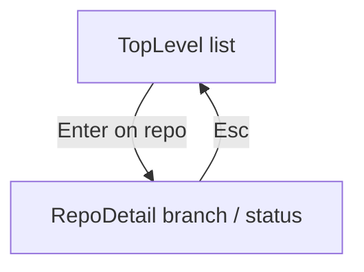

# git-interactive-repos

Browse immediate subdirectories of the current directory, show git branch and dirty state, and run common repo actions from the keyboard.

## Usage

```bash
git interactive repos
```

Run from a directory whose child folders you want to inspect (for example a parent folder that contains several clones).

The UI uses the terminal’s **alternate screen** (full-screen TUI). Your shell session is restored after you quit.

On the top-level list, the first column after the selection marker is a **status character**: space (clean git), `*` (dirty), `%` (still scanning), `!` (not a git repo). The branch column shows the current branch (or `<scanning>` / `<not-git>`). Long names are elided to fit the terminal (60% width for the directory name, remainder for the branch column; middle elision with `…` when there is room).

If the terminal is too narrow to show at least one content column, the program exits with an error before starting the UI.

## Modes



The **branch** panel always lists branches (the full list when focus is on **status**; filtered by substring while **branch** is focused—type to filter, case-insensitive). The checked-out branch is highlighted. With **branch** focused, **arrow Up/Down** move the highlight and **Enter** checks out; **Alt+b** opens a small editor to name a new branch created from the current HEAD (`git switch -c`). When focus leaves the branch column, the highlight shows the current branch on the full list. **Arrow Left/Right** move focus between **branch** and **status**.

The **status** panel shows `git status --porcelain` as a list (each line truncated to the column width). A leading **º** marks lines where the index column is non-empty (staged), so `M ` (staged) is easier to tell from ` M` (worktree only). One line is **selected** (like the branch column); **arrow Up/Down** move the selection and the view scrolls to keep it visible, wrapping at the top and bottom of the file list. **Enter** on the status column does not run a destructive action by itself; whole-repo reset is **Alt+Shift+r** (see below).

Status shortcuts use **Alt** so plain letters still go to the branch filter when the branch column is focused. With **status** focused: **Alt+?** opens a help overlay; **Alt+r** resets the selected file to HEAD (confirm, then `git restore --source=HEAD`); **Alt+Shift+r** opens whole-repo reset confirm (only if the repo is dirty); **Alt+a** stages the selected path; **Alt+u** unstages it; **Alt+d** runs `git --no-pager diff HEAD -- <path>` piped to `less` (short diffs stay visible; plain `git diff` can exit immediately if your pager is configured to quit on one screen) and returns to the TUI afterward; **Alt+i** opens a small editor to append one line to `.gitignore` (**Enter** appends, **Esc** cancels); **Alt+s** runs `git stash push`; **Alt+p** runs `git stash pop`; **Alt+c** checks that something is staged (`git diff --cached`); if not, a warning is shown instead of opening the editor—otherwise it runs `git commit -e -m "$(git rev-parse --abbrev-ref HEAD)"` (the TUI suspends so your normal `git` editor opens with the branch name as the initial message; if the branch is **main**, a confirmation screen appears before the editor, after the staged check).

## Keys

| Context | Keys |
|--------|------|
| Top level | **Arrow Up/Down** move selection; **Enter** opens a git repo row; **q** / **Esc** quit |
| Top level | **Ctrl+C** quit (works in every mode) |
| Repo detail | **Arrow Left/Right** move focus between branch and status |
| Repo detail | **Enter** runs the focused action (branch checkout only; **Enter** on status is a no-op); **Esc** back to top level |
| Repo detail, branch focused | **Arrow Up/Down** move in the filtered list; type to filter branches; **Enter** checks out the highlighted branch; **Alt+b** create branch from current HEAD (see below) |
| New branch name editor | **Enter** run `git switch -c` with the typed name; **Esc** cancel; **Left/Right** move caret; **Backspace** delete before caret; other printable keys insert |
| Repo detail, status focused | **Arrow Up/Down** move the highlight to choose a porcelain line; the view scrolls as needed (wraps at the ends of the list); **Alt+** shortcuts as in the paragraph above |
| Status help overlay | **Esc** or **q** dismiss |
| Gitignore line editor | **Enter** append pattern to `.gitignore`; **Esc** cancel; **Left/Right** move caret; **Backspace** delete before caret; other printable keys insert |
| Confirm reset file | **Enter** confirm `git restore --source=HEAD` for the selected path; **Esc** cancel |
| Nothing staged (commit) | **Enter** / **Esc** / **q** dismiss |
| Confirm commit on **main** | **Enter** confirm `git commit -e -m …` if staged (see **Alt+c** above); **Esc** cancel |
| Confirm reset (whole repo) | **Enter** confirm `git reset --hard` and `git clean -fd`; **Esc** cancel |

On macOS, **Option** chords (e.g. **Option+i**, **Option+u**) can enqueue stray accent characters (**ˆ**, **¨**, …) as separate key events; the gitignore editor ignores those until you type a normal character, and strips any that still end up at the end of the line on **Enter**. On some keyboards, **?** is typed with **Shift**; if **Alt+?** does not fire, try **Alt+Shift+/**.

Rows still **scanning** ignore **Enter**. Non-git directories ignore **Enter** on the top-level list.

## Dangerous operations

Confirming **whole-repo** reset runs **`git reset --hard`** followed by **`git clean -fd`** in that repository, which discards local changes and removes untracked files and directories. There is no undo.

Confirming **reset selected file** overwrites that path in the working tree from HEAD (same idea as discarding changes to that file).

## Requirements

- `git` on `PATH`
