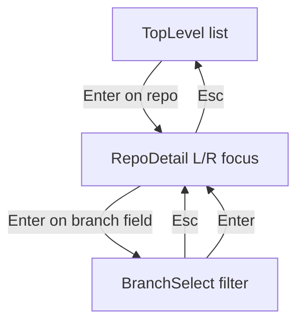

# git-interactive-repos

Browse immediate subdirectories of the current directory, show git branch and dirty state, and run common repo actions from the keyboard.

## Usage

```bash
git interactive repos
```

Run from a directory whose child folders you want to inspect (for example a parent folder that contains several clones).

The UI uses the terminal’s **alternate screen** (full-screen TUI). Your shell session is restored after you quit.

On the top-level list, the first column after the selection marker is a **status character**: space (clean git), `*` (dirty), `%` (still scanning), `!` (not a git repo). The branch column shows the current branch (or `<scanning>` / `<not-git>`). Long names are elided to fit the terminal (60% width for the directory name, remainder for the branch column; middle elision with `…` when there is room).

If the terminal is too narrow to show at least one content column, the program exits with an error before starting the UI.

## Modes



After choosing **Enter** on a dirty status field, a confirmation screen appears before any destructive command runs.

## Keys

| Context | Keys |
|--------|------|
| Top level | **Up/Down** or **j/k** move selection; **Enter** opens a git repo row; **q** / **Esc** quit |
| Top level | **Ctrl+C** quit (works in every mode) |
| Repo detail | **Left/Right** (or **h/l**) move focus between branch, status, and stash |
| Repo detail | **Enter** runs the focused action; **Esc** back to top level |
| Branch list | **Up/Down** / **j/k** move; type to filter branches (substring, case-insensitive); **Enter** checks out; **Esc** back |
| Confirm reset | **Enter** confirm `git reset --hard` and `git clean -fd`; **Esc** cancel |

Rows still **scanning** ignore **Enter**. Non-git directories ignore **Enter** on the top-level list.

## Dangerous operations

Confirming reset runs **`git reset --hard`** followed by **`git clean -fd`** in that repository, which discards local changes and removes untracked files and directories. There is no undo.

## Requirements

- `git` on `PATH`
